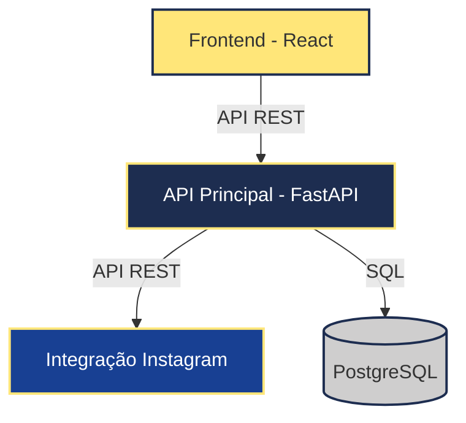

# Proteus.lab - Arquitetura do Sistema

## Visão Geral

O Proteus.lab é uma plataforma de serviços de impressão 3D que segue uma arquitetura de microserviços. O sistema consiste em três componentes principais que se comunicam via APIs REST:

1. **Frontend (React)** - Interface de usuário responsiva
2. **API Principal (FastAPI)** - Backend principal para gerenciamento de dados
3. **Serviço Instagram** - Integração com a API externa do Instagram

## Fluxograma da Arquitetura

## Componentes do Sistema

### 1. Frontend (React)

Interface de usuário responsiva que permite aos clientes:
- Navegar pelo catálogo de produtos e serviços
- Fazer upload de modelos 3D para orçamento
- Acompanhar o status de pedidos
- Visualizar portfolio de projetos anteriores via Instagram

**Tecnologias:**
- React 18
- TypeScript
- Tailwind CSS
- React Router
- Tanstack Query

### 2. API Principal (FastAPI)

Serviço backend responsável por:
- Gerenciar usuários e autenticação
- Processar solicitações de orçamento
- Gerenciar pedidos e seus estados
- Armazenar e recuperar modelos 3D
- Integrar com outros serviços

**Tecnologias:**
- Python 3.10
- FastAPI
- SQLAlchemy
- PostgreSQL
- JWT para autenticação

### 3. Integração Instagram (API Externa)

Serviço responsável por:
- Consumir a API do Instagram
- Recuperar posts recentes do perfil @proteus.lab
- Processar e categorizar as imagens para exibição
- Cachear resultados para otimizar performance

**Tecnologias:**
- Python 3.10
- Requests
- Redis para cache

## Fluxos Principais

### Fluxo de Solicitação de Orçamento

1. Cliente faz upload de modelo 3D via frontend
2. API Principal recebe o arquivo, valida e armazena
3. Sistema calcula estimativa de preço baseado em volume/material
4. Cliente recebe orçamento e pode aprovar
5. Pedido é criado no sistema

### Fluxo de Exibição de Portfólio

1. Cliente acessa a página de portfólio no frontend
2. Frontend solicita dados à API Principal
3. API Principal consulta serviço de integração Instagram
4. Serviço Instagram retorna posts mais recentes
5. Dados são exibidos no frontend de forma organizada

## Comunicação entre Componentes

Toda a comunicação entre os componentes é feita via API REST, seguindo padrões HTTP:

- **GET**: Para recuperar dados (produtos, orçamentos, etc.)
- **POST**: Para criar novos recursos (orçamentos, pedidos, etc.)
- **PUT**: Para atualizar recursos existentes
- **DELETE**: Para remover recursos

## Armazenamento de Dados

O sistema utiliza PostgreSQL como banco de dados principal, com as seguintes entidades:

- Usuários
- Produtos
- Serviços
- Orçamentos
- Pedidos
- Arquivos 3D (metadados, com os arquivos em si armazenados no sistema de arquivos)

## Observabilidade e Monitoramento

O sistema implementa logs detalhados em cada componente para facilitar o diagnóstico de problemas e monitoramento de performance. Ferramentas como Redis são utilizadas para melhorar a performance e resiliência do sistema.
